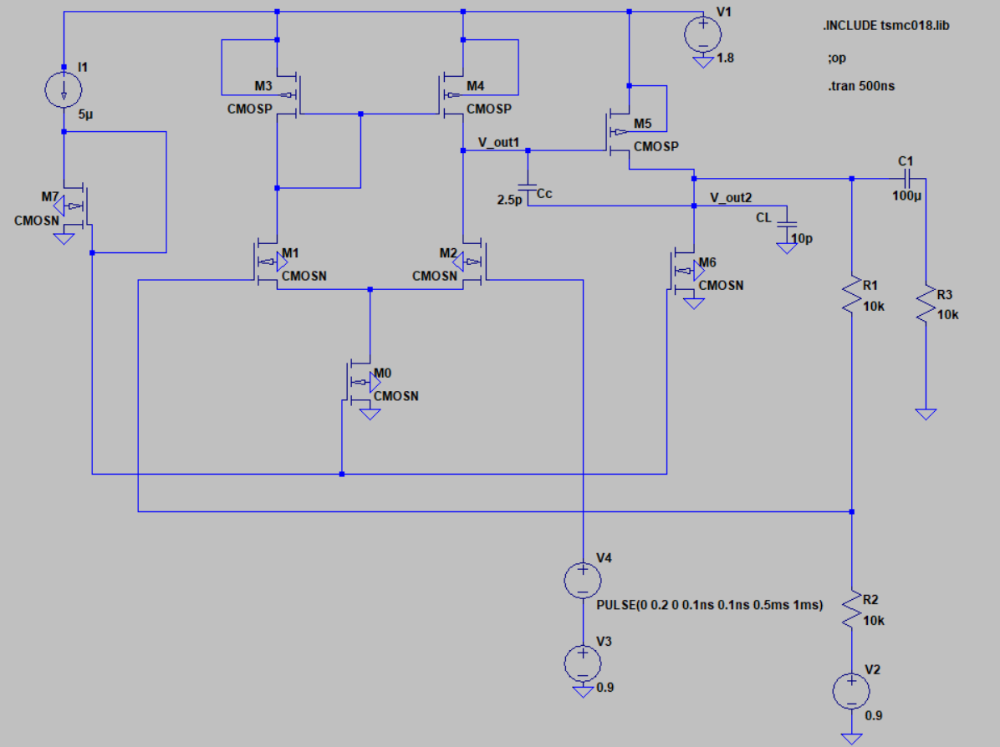

# Design and Layout Implementation of a Two-Stage Opamp using 180nm Technology

This project involves the **design and simulation of a two-stage Operational Amplifier (Opamp)** using **TSMC 180nm CMOS technology**. The design meets required performance specifications for gain, bandwidth, phase margin, slew rate, and power efficiency.

---

## Schematic

## Technology & Tools

- **Technology**: TSMC 180nm
- **Simulation Tool**: LTspice
- **Model File**: `tsmc018.lib`

---

## Design Specifications

| Parameter              | Target Value  |
|------------------------|---------------|
| Supply Voltage (Vdd)   | 1.8 V         |
| DC Gain                | ≥ 40 dB       |
| GBW                    | ≥ 10 MHz      |
| Phase Margin           | ≥ 60°         |
| Slew Rate              | ≥ 20 V/μs     |
| ICMR(+)                | ≥ 1.6 V       |
| ICMR(−)                | ≤ 0.8 V       |
| Load Capacitance (CL)  | 10 pF         |
| Compensation Cap (Cc)  | 2.5 pF        |
| Power Dissipation      | ≤ 300 μW      |

---

## Design Methodology

- **Bias Current I0**: Based on Slew Rate
- **(W/L)M1,M2**: Derived from GBW
- **(W/L)M3,M4**: Calculated using ICMR(+)
- **(W/L)M0**: Set by ICMR(−)
- **(W/L)M5**: Determined by Phase Margin
- **(W/L)M6,M7**: Derived from current mirror ratio
  
---

## 📊 Simulation Results

- **DC Gain**: 59.3 dB  
- **Phase Margin**: 62.17°   
- **Power Dissipation**: < 300 μW
- **Closed Loop Gain**: 2

---

## 🖼️ Analysis Plots

### AC Analysis  

### Transient Response  

